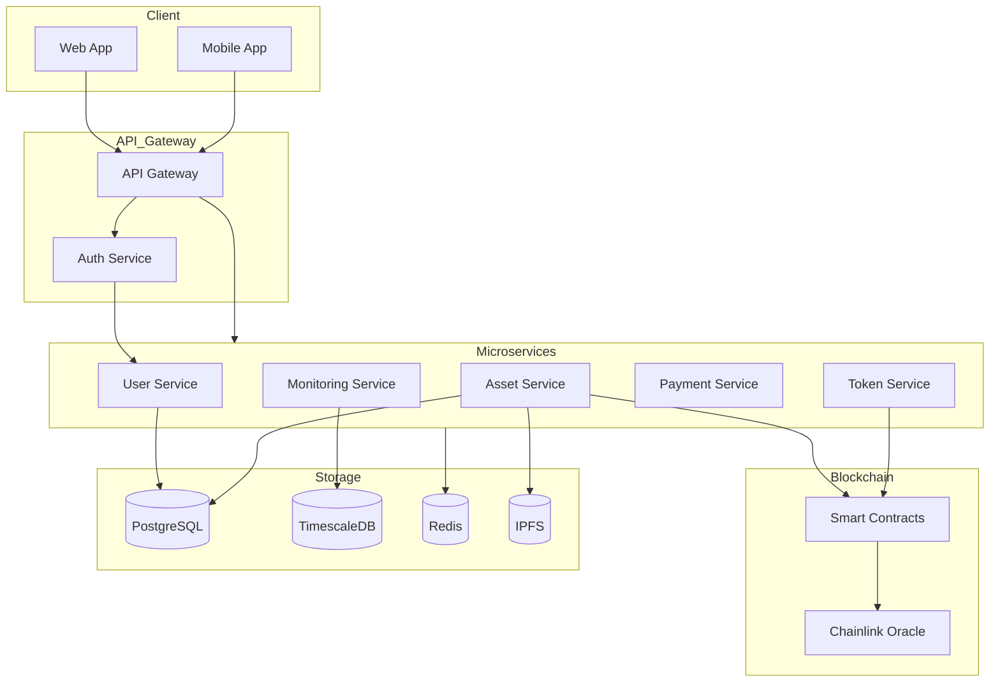

# High-Level Architecture Diagram

## 🏗️ General Architecture

## 🔄 Data Flow

1. **Client Layer**
   - Web App (Next.js)
   - Mobile App (PWA)
   - Wallet Integration

2. **API Gateway**
   - Load Balancing
   - Request Routing
   - Authentication
   - Rate Limiting

3. **Microservices**
   - User Management
   - Asset Management
   - Token Operations
   - Payment Processing
   - Production Monitoring

4. **Blockchain Layer**
   - Smart Contracts
   - Oracle Integration
   - Token Management

5. **Storage Layer**
   - Relational Data (PostgreSQL)
   - Time Series Data (TimescaleDB)
   - Caching (Redis)
   - Decentralized Storage (IPFS)

## 🔐 Security

- JWT Authentication
- Role-Based Access Control
- SSL/TLS Encryption
- Smart Contract Auditing
- Multi-signature Wallets

## 📈 Scalability

- Horizontal Scaling
- Load Balancing
- Caching Strategies
- Database Sharding
- Microservices Independence 